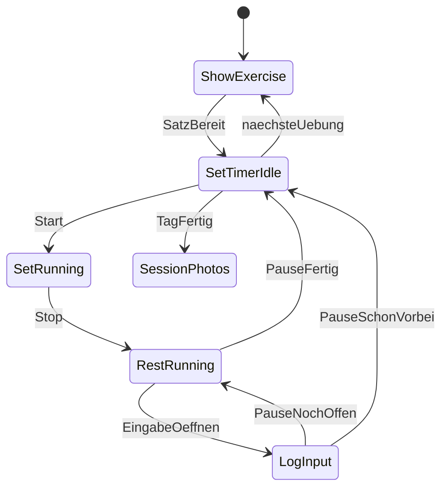
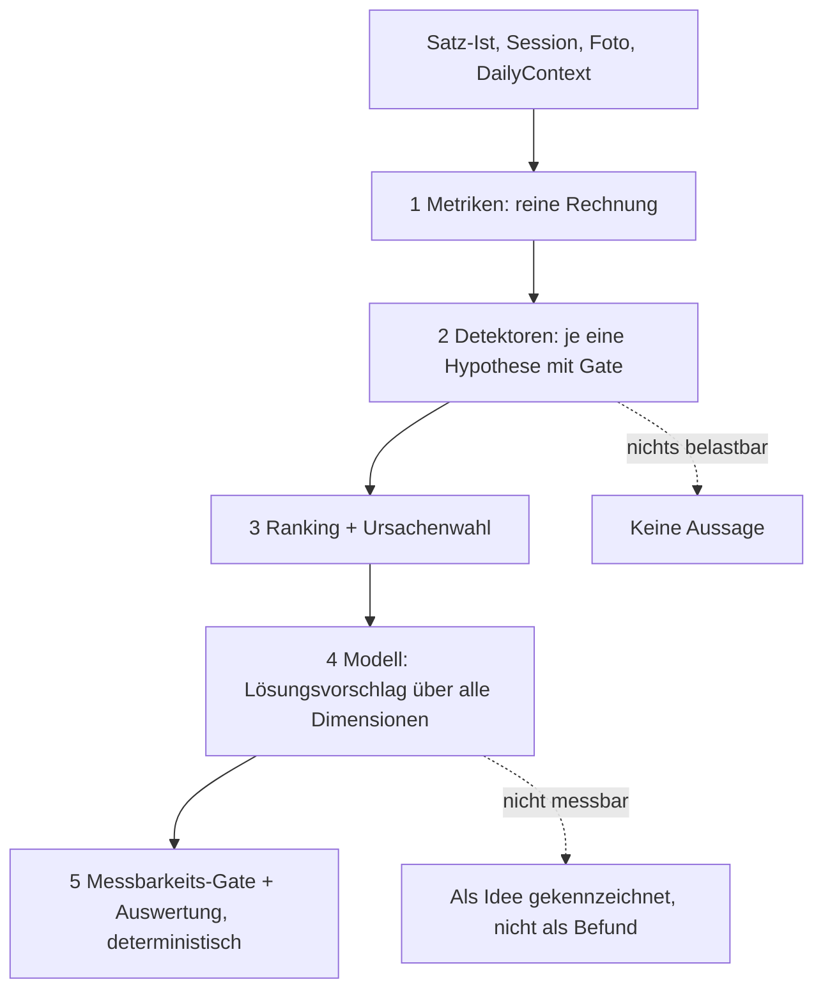

# Guided Workout App — Produktplan

Persönliche Coach-App für **einen Nutzer und einen festen Plan**. Die erste Version führt dich Satz für Satz durch Push / Pull / Legs, speichert jede relevante Zahl und jedes Foto so, dass später Ursachen (nicht nur Symptome) ableitbar sind.

## Produktprinzipien

- **Führen, nicht listen:** Nächster Schritt ist immer klar. Du bestätigst Start/Stop und Zahlen.
- **Gym-tauglich:** Große Targets, eine Hand, Screen bleibt an, Pause-Ende per Vibration/Ton — du musst nicht aufs Display starren.
- **Ist schlägt Soll:** Zielpause und Ziel-Wdh. sind Vorgaben. Gespeichert wird, was passiert ist — inklusive fehlender Satzdauer, wenn du den Timer vergessen hast.
- **Zwei Timer, zwei Bedeutungen:** Satz-Timer = Arbeit (wie lange für diese Wdh. bei diesem Gewicht). Pausen-Timer = Erholung. Nie vermischen. Satz-Timer startet nie von allein.
- **Analyse darf nicht vergiftet werden:** Übersprungene Übungen, Ersatzgeräte, abgebrochene Sessions und „schlechter Tag“ sind erstklassige Daten, nicht Lücken.
- **Ursache vor Slogan:** Beobachtung → geprüfte Kandidaten → benannte Ursache → Zahlen.
- **Ein Plan, versioniert:** Der Split ist deiner, nicht generisch. Du darfst Soll-Werte im Menü ändern; jede Speicherung ist eine neue `PlanVersion`. Alte Sessions bleiben gegen die damalige Version vergleichbar.

Nicht in v1: Plan-Baukasten für beliebige Splits/andere Nutzer, automatische Foto-KI, automatisches Hochsetzen der Last. **Whoop ist ausdrücklich in v1 enthalten.**

## Funktionsumfang nach Version

**v1 — führen und speichern**

- Session starten: Vorschlag = **nächster Tag im PPL-Zyklus** (Warteschlange, nicht Wochentag); manuell überschreibbar
- Direkt danach Readiness-Screen: **Gut / Okay / Schlecht** (ein Tap). Am Ende: **normal / schlechter Tag / abgebrochen** (ein Tap). Beides ist Whoop-lite und wird durch Whoop ersetzt, sobald die Anbindung da ist — gleiches Feld `DailyContext`, andere Quelle
- Geführter Ablauf: Warm-up, Arbeit, Supersets, Satz-Timer manuell, Pausen-Timer im Hintergrund während der Eingabe
- Pause-Ende: Vibration und Ton (Handy liegt in der Pause nicht in der Hand)
- Screen an während offener Session; Zustand fortlaufend speichern (Sperre/Absturz dürfen Restpause und offene Eingabe nicht löschen)
- Pro Satz: Gewicht, Wdh., Satzdauer (oder **fehlend**, nie 0 bei vergessenem Timer), Pause-Ist, Uhrzeit
- Satz-Screen zeigt **letzte Zahlen** dieser Übung (Gewicht, Wdh., Dauer)
- Übung überspringen oder ersetzen mit Grund (Gerät belegt / Schmerz / Zeit) — Pec Deck statt Flies ist Ersatz, nicht „Flies 0 kg“
- Nach der Session: 1–n Fotos in Pose-Slots plus Mini-Protokoll (gleicher Slot, Abstand, Licht)
- Körpergewicht selten, gleiche Bedingungen (sonst sind Foto-Urteile in der Diät unbrauchbar)
- **Last-Empfehlung immer auf der Übung**, sobald sie dran ist — nicht nach der Session. Steigerung oder Halten, nie leer. Kein „Empfehlung übernehmen“-Button: was du nach dem Satz als Gewicht einträgst, ist die Entscheidung. Der Plan (z. B. 4× 6–10) bleibt unangetastet
- Menü **Mein Plan:** Soll-Sätze, Ziel-Wdh. und Zielpause je Übung manuell anpassen (siehe unten). Das ist die einzige Stelle, an der sich der Plan ändert — und nur weil du speicherst
- Einfache Auswertungen in der Muster-Reihenfolge unten
- Unterbrechen/Fortsetzen; letzten Satz korrigieren; **Export der Historie**

- **Whoop-Integration ab v1** (siehe eigene Sektion): Recovery, HRV, Schlaf, Tagesbelastung und die Whoop-Workout-Daten der Session
- Readiness-Tap bleibt trotz Whoop — subjektives Gefühl und Recovery-Score widersprechen sich oft, und genau dieser Widerspruch ist ein eigenes Signal

**v2** — begründete Zusammenhänge, Foto als Trigger, Lösungsvorschläge über alle Dimensionen

## Kanonischer Plan (Reihenfolge in der App)

Liste im Prompt und Positions-Notiz zu Cable Flies weichen ab. **Führend ist die Positions-Notiz.** Warm-ups direkt vor der zugehörigen Arbeitsübung.

**Push**

1. Warm-up Incline Press — 3 Sätze: leer/leicht 10–12 → ~50% 6–8 → ~75–80% 3–4
2. Incline Chest Press — 4× 6–10, Pause 120–150s
3. Flat Bench / Machine Press — 3× 6–10, Pause 120s
4. Dips (Trizeps-Fokus) — 3× 8–12, Pause 90s
5. Overhead Tricep Extensions — 3× 10–12, Pause 60–75s
6. Cable Flies — 2× 12–15, Pause 60s *(zwischen den beiden Isolations-Trizeps-Übungen)*
7. Tricep Pushdowns (cross-cable) — 3× 10–15, Pause 60s

**Pull**

1. Warm-up Pull-ups — 1× locker 5–8
2. Pull-ups — 4× max, Pause 120s
3. Enges Rudern — 3× 8–12, Pause 120s
4. Lat Pulldowns — 3× 10–12, Pause 75–90s
5. Reverse Pec Deck Flys — 3× 12–15, Pause 60s
6. **Superset:** Bizeps Curls 3× 8–12 → Wrist Curls 3× 12–15, Pause 60–75s erst nach Wrist Curls
7. Hammercurls — 3× 10–12, Pause 60s

**Legs / Schultern**

1. Warm-up Leg Press — 1× leicht 10–12, 1× ~50–60% 6–8
2. Leg Press — 4× 8–12, Pause 150s
3. Warm-up RDL — 1× leicht 8–10
4. Romanian Deadlifts — 3× 8–10, Pause 120s
5. Wadenheben — 3–4× 12–15, volle ROM, Pause 45–60s
6. **Superset:** Lateral Raises 3× 12–15 → Shrugs 3× 10–12, Pause 60–75s erst nach Shrugs
7. Shoulder Press Machine — 3× 8–12, Pause 75–90s

Pause-Spannen: Timer auf die **untere Grenze**; länger bleiben erlaubt. Wadenheben: Standard 4 Sätze, letzter optional — im Menü auf 3 oder 4 festsetzbar. Flat Bench / Machine Press und ähnliche Oder-Stellen: vor der Übung einmal wählen, in der Session getrennt speichern; Default der Oder-Stelle im Menü setzbar.

## Menü: Mein Plan

Kein Baukasten für fremde Splits. Ein Screen außerhalb der Session, auf dem **dein** PPL justierbar ist.

**Pro Übung (inkl. Warm-up) änderbar in v1**

- Anzahl Arbeitssätze (bzw. Warm-up-Sätze)
- Ziel-Wiederholungen: min/max, oder „max“ (Pull-ups)
- Zielpause: min/max (Timer zielt weiter auf die untere Grenze)
- Übung **im Plan lassen / aus dem geführten Ablauf nehmen** (dauerhaft raus, nicht dasselbe wie Skip in einer Session)
- Bei Oder-Stellen den Default (z. B. Flat Bench vs. Machine)

**Nicht in v1** (würde den Coach-Ablauf und Supersets leicht zerlegen)

- Neue Übungen frei hinzufügen, Reihenfolge per Drag, Supersets neu verdrahten, kompletten Split umbauen

**Speichern**

- Jedes Speichern erzeugt eine neue `PlanVersion` (Datum). Offene Session behält die Version, mit der sie gestartet ist. Nächste Session nutzt die neue.
- Analyse vergleicht Stagnation nur innerhalb derselben PlanVersion oder kennzeichnet den Bruch („ab hier 5 Sätze Incline statt 4“).
- Last-Empfehlung schreibt hier nichts. Nur du schreibst Soll-Sätze/Wdh./Pause. Das Gewicht, das du satzweise einträgst, ist Ist — kein Extra-Button.

## Ablauflogik — Timer-Rhythmus

Der Pausen-Timer **stoppt nicht für die Eingabe**. Er wird nur ausgeblendet. Nach der Eingabe erscheint **derselbe** Rest. Der Satz-Timer startet **nie von allein**.

**Ein Arbeitssatz**

1. Screen: Übung, Satz x von n, Ziel-Wdh., Zielpause, **letzte Zahlen**, **immer eine Empfehlung** (kg, mit Kurzgrund). Bei Spannen-Übungen zusätzlich die Ansage: **am oberen Rand stoppen** (bei 6–10 also bei 10, nicht 12). Gewicht-Feld später mit der Empfehlung vorbelegt. Button **Satz starten**.
2. Training. Button **Satz stoppen**. Satzdauer = Stop minus Start.
3. **Pause startet sofort** und läuft im Hintergrund weiter.
4. Timer-UI weg, Eingabe Wdh. + Gewicht (Vorbelegung: aktuelle Empfehlung — beim ersten Arbeitssatz die aus der letzten Session, danach das Gewicht, das du in dieser Übung gerade eingetragen hast).
5. Nach Bestätigen: Pausen-Timer **wieder da**, Restzeit = Ziel minus schon vergangene Zeit (inkl. Tippen).
6. Pause fertig → Vibration/Ton, Screen **Satz starten**. Kein Auto-Start.
7. Nächster Satz oder nächste Übung.

**Kanten**

- Eingabe länger als Restpause: kein zweites Einblenden, direkt nächster Satz-Start. Pause-Ist = Satz-Stop bis Eingabe fertig.
- Früher „bereit“: Pause-Ist unter Soll.
- Länger nach Timer-Ende: erst „bereit“ gibt den Satz-Timer frei. Pause-Ist über Soll.
- **Satz-Timer vergessen:** Dauer = fehlend, nicht 0. Analyse ignoriert fehlende Dauern, statt sie als „superschneller Satz“ zu lesen.
- **„Nicht typisch“-Marker:** kleiner Button auf dem Pausen-Screen und in der Eingabe, plus nachträglich am letzten Satz und im Verlauf. Ein Tap, dann ein Grund aus einer kurzen Liste. Damit wird eine ungewöhnlich lange oder kurze Pause (oder ein vermasselter Satz) als **Störung** gekennzeichnet, statt als dein Verhalten gelesen zu werden. Details unten in der Analyse-Sektion.
- **Warm-up:** gleicher Start/Stop, klar markiert, **kein Pausen-Zwang**. Zählen nicht in Arbeits-Stagnation/Volumen.
- **Superset:** Nach A kein Pausen-Timer, direkt B (A idealerweise sofort loggen). Nach B: Pause → Eingabe blendet aus → Pause kommt wieder → nächste Runde A.
- Letzter Satz einer Übung: diese Pause **ist** die Pause vor der nächsten Übung.
- Screen während offener Session an lassen (oder sehr langes Timeout). Pause-Ende muss spürbar sein, wenn das Handy in der Tasche liegt.
- Crash/Sperre: Zustand inkl. Pause-Rest und Satz-Stop-Zeitpunkt fortlaufend merken.

## Datenmodell (konzeptionell)

**Plan-Vorlage** — `PlanVersion`, `DayTemplate`, `Block` (Übung oder Superset), `SetPrescription`, `Exercise`. Bekannte Ersatz-Aliase (z. B. Cable Flies ↔ Pec Deck), damit Ersatz nicht wie eine neue Übung wirkt.

**Session** — Datum, Wochentag, Tag im Zyklus, Start/Ende/Dauer, Status, `PlanVersion`, Readiness (gut/ok/schlecht, Quelle: Tap, später Whoop), Session-Tag (normal/schlechter Tag/abgebrochen), Zeiger auf den nächsten Tag in der PPL-Warteschlange.

**Last-Empfehlung** — immer sichtbar, sobald die Übung startet. Nicht im Plan gespeichert, abgeleitet aus der letzten *ausgeführten* Arbeits-Serie (nicht Warm-up, nicht übersprungen, nicht ersetzt). Nur Sätze mit **gleichem Arbeitsgewicht**; wenn du innerhalb der Übung das Gewicht geändert hast, zählt die letzte zusammenhängende Serie bei dem Gewicht, das du am häufigsten hattest — in v1 einfacher: es zählt das Gewicht des **ersten Arbeitssatzes**, Folgesätze bei anderem Gewicht fließen nicht in die Steigerungsentscheidung. Kein Übernehmen-Button: Eintragen nach dem Satz reicht.

Entscheidung ist streng, damit 10 / 11 / 7 nicht als Freifahrtschein nach oben gelesen wird. Zielspanne z. B. 6–10, letztes Arbeitsgewicht 80 kg:

- **Steigern** nur wenn **jeder** Arbeitssatz ≥ obere Grenze (hier alle ≥ 10). Dann Empfehlung = Gewicht + Schritt (typisch +2,5 kg; Isolation/Kurzhantel +1–2 kg).
- **Senken** nur wenn **mindestens ein** Arbeitssatz **unter** der unteren Grenze liegt (hier < 6). Dann Empfehlung = Gewicht − Schritt.
- **Halten** in jedem anderen Fall — auch gemischt, auch wenn einzelne Sätze über der oberen Grenze sind. Empfehlung = **letztes Gewicht**. Nie „keine Empfehlung“.

Beispiel 10 / 11 / 7 bei 6–10: Satz 1 und 2 schaffen oder übertreffen 10, Satz 3 hat 7. 7 liegt in der Spanne, also kein Senken. Weil nicht *alle* Sätze ≥ 10, **kein Steigern**. Empfehlung: **80 kg halten**. Kurzgrund: „letzter Satz unter der oberen Grenze“. Nächstes Mal: **bei 10 stoppen**, nicht 11/12, damit Satz 3 noch 10 kann.

**Wdh. im Satz: am oberen Rand stoppen (Standard)**

Die Spanne 6–10 ist keine Aufforderung, so viele Wdh. wie möglich zu machen. Wenn 12 gehen, machst du trotzdem **10** — außer die Übung ist explizit „max“ (Pull-ups). 12 im ersten Satz ist genau der Grund, warum Satz 3 bei 7 landet. Doppelprogression heißt: alle Arbeitssätze an die obere Grenze bringen, *dann* Gewicht erhöhen.

- Spannen-Übungen (6–10, 8–12, 12–15, …): Stop bei der **oberen Grenze**, auch wenn mehr gehen. Screen sagt das vor dem Satz.
- „max“-Übungen: kein Stop, so viele saubere Wdh. wie möglich.
- Über der Grenze eintragen (11, 12) bleibt erlaubt — Ist schlägt Soll — zieht aber keine Steigerung, solange ein späterer Satz darunter liegt. Die App darf danach den Hinweis zeigen: „Nächstes Mal bei 10 stoppen.“

Kein AMRAP-letzter-Satz in v1 (würde die Regel weichspülen). Im Menü später optional, nicht jetzt.

Warum nicht Mittelwert oder Mehrheit: 10 und 11 würden „ja“ stimmen, du lädst 82,5 und Satz 3 bricht wieder ein. Der schwächste Arbeitssatz ist die Bremse, nicht der stärkste.

Weitere Kanten:

- „max“-Übungen (Pull-ups ohne Zusatzlast): Steigern wenn jeder Satz mindestens so viele Wdh. hat wie beim letzten Mal (oder fester Schwellenwert); sonst halten. Zusatzlast erst vorschlagen, wenn alle Sätze klar über einer gesetzten Wdh.-Marke liegen (im Menü, Default z. B. 10).
- Ab Satz 2 **heute**: Vorbelegung = das Gewicht, das du gerade eingetragen hast, unabhängig von der Wochen-Empfehlung.
- Readiness „schlecht“ oder Session-Tag „schlechter Tag“ ändert die Zahl nicht in v1 (sonst wird Whoop-lite zur Ausrede-Automatik). Nur der Kurzgrund darf das erwähnen.

Der Plan (Sätze × Wdh.-Spanne) ändert sich dadurch nicht.

**Satz-Ist** — Warm-up-Flag, Soll vs. Ist, Satzdauer oder fehlend, Pause-Ist, Uhrzeit, Superset `round_index` + A/B. Optional später RPE — in v1 nicht abfragen.

**Störungs-Marker am Satz** — optional, drei Felder: betrifft (Pause / Satz), Kategorie (von außen / von mir / Satz vermasselt), Grund aus kurzer Liste. Der Messwert wird **nie überschrieben oder gelöscht** — 240 s Pause bleiben 240 s. Nur die Interpretation ändert sich.

**Übung-Ist zusätzlich** — `ausgeführt` / `übersprungen` / `ersetzt` plus Grund. Ersatz zeigt auf die tatsächlich gemachte Übung.

**Kontext** — `Photo` (Session, Pose-Slot, Ort-/Licht-Notiz, Vergleichsschlüssel, Verweis auf das Vorgängerfoto desselben Slots). `PoseGuide` pro Slot (Anleitungstext, Referenzbild). `Bodyweight` (Datum, kg, Bedingung z. B. morgens, seltener Rhythmus).

**`DailyContext`** — ab v1 mit Whoop befüllt, plus Readiness-Tap. Felder: Whoop-`cycle_id` und `sleep_id`, Recovery-Score, HRV (RMSSD) **und Abweichung vom eigenen Baseline**, Ruhepuls, Schlafdauer und -performance, Tages-Strain, Status (`pending` / `complete`), Quelle. Der Readiness-Tap bleibt als eigenes Feld daneben, nicht als Ersatz.

**Probe (Trial)** — Fragestellung, Variation (was wird geändert), Startdatum, Laufzeit, Erfolgskriterium, Status. Sessions innerhalb einer Probe sind markiert, damit die Auswertung sie nicht als normale Wochen liest.

**Foto-Slots**

- Push: Brust frontal, Brust seitlich, Arme (Trizeps) gebeugt
- Pull: Rücken, Arme (Bizeps) seitlich
- Legs: Beine frontal, Schultern seitlich

Jeder Slot hat eine **von der App vorgegebene Pose** (ein Satz Anleitung plus Referenzbild), einen **einmal festgelegten Ort mit Lichtsituation** und beim Auslösen das **vorherige Foto als halbtransparente Schablone** über dem Kamerabild. Selbstauslöser statt ausgestreckter Arm. Ohne Slot und ohne konstante Pose sind Fotos ein Album, kein Verlauf.

**Abgeleitet**

- Volumen = Gewicht × Wdh.
- Zeit pro Wdh. = Satzdauer / Wdh. (nur wenn Dauer vorhanden)
- Pause-Abweichung = Pause-Ist − Pause-Soll
- Uhrzeit-Bucket
- Drop-off Satz 1 vs. letzter Arbeitssatz

## Musteranalyse — priorisiert

Aussagen immer: **Beobachtung → geprüfte Kandidaten → Ursache → Zahlen.** Mindeststichprobe (z. B. 4 gleiche Tage), Warm-ups raus, gleiche Planversion, übersprungene/ersetzte Übungen nicht als „0 kg“ werten, „schlechter Tag“ und Readiness „schlecht“ nicht in Stagnationsfenster mischen.

### Sofort (v1)

1. **Tempo bei gleicher Last** — Killer-Metrik des Satz-Timers. 80 kg × 8 in 22 s vs. 35 s.
2. **Pause zu kurz → Folgesatz schwächer**
3. **Pause zu lang („Auskühlen“)** — Fenster, nicht „länger = besser“
4. **Drop-off Satz 1 → letzter Satz**
5. **Klassische Stagnation** (Last und Wdh.)
6. **Position im Split / Vorermüdung** (Flies nach Overhead, Isolation zuletzt)
7. **Pausenkonsistenz**
8. **Uhrzeit vs. Performance**
9. **Warm-up-Qualität → erster Arbeitssatz**
10. **Trainingsdichte** (Volumen / Sessiondauer)

### Nächste Welle (v1)

11. **Superset-Preis**
12. **Späte Übungen vs. Sessionlänge**
13. **Lastsprünge vs. saubere Progression**
14. **Wadenheben als ROM-/TUT-Check** (kurze Dauer bei 12–15 = Verdacht Teil-Wdh.)
15. **Pull-ups als Frische-Barometer**
16. **Nur Satz 1 als Readiness** (Brücke zu Whoop)
17. **Gerät/Variante getrennt** (Bank vs. Maschine, Ersatz vs. Planübung)
18. **Bodyweight-Übungen mit vs. ohne Zusatzlast** nicht in eine Reihe

### Foto (v2)

19. Sichtbarer Muskel vs. lokale Last
20. Compound steigt, Isolation und Foto nicht
21. Foto hängt der Leistung hinterher (Verzögerung, Pump)
22. Post-Workout-Pump vs. echte Form — v1-Fotos sind Pump-Fotos
23. Asymmetrie nur als Flag, keine Scheinkausalität
24. **Körpergewicht als Störfaktor** — Arme „gleich“ bei fallendem Gewicht kann Erhalt sein, kein Trainingsfehler

### Whoop (Daten ab v1, Detektoren sobald genug Tage vorliegen)

25. Recovery vs. Satz 1 vs. Drop-off
26. Schlaf → frühe Compounds
27. HRV vs. Tempo (Qualität weg, bevor Last kippt)
28. Strain gestern vs. heutige Isolation
29. Training trotz niedriger Recovery als Muster „halten, nicht PR“

### Mund halten

30. Zu wenige Sessions
31. Fehlender Foto-Slot
32. Planversion gewechselt
33. Urlaub, Abbruch, Skip — Lücken sind Lücken
34. Fehlende Satzdauer nicht als 0 s

v1 zeigt ohne KI-Prosa: Verlauf Last / Wdh. / Zeit-pro-Wdh.; Pause-Abweichung; Pause vs. Folgesatz; Uhrzeit vs. Volumen; Foto-Timeline je Slot. Die Liste oben ist die Reihenfolge, in der Erklärungen dazukommen.

## Analyse — Architektur und Vorgehen

Das ist der größte Brocken und der einzige Teil, der **falsche Aussagen** produzieren kann. Ein vergessener Timer ist ein fehlendes Feld; eine erfundene Ursache lässt dich monatelang das Falsche ändern. Deshalb ist die Analyse kein „Daten an ein Modell geben“, sondern eine Kette mit harten Grenzen.

### Das eigentliche Problem: zwei verschiedene Uhren

- **Innerhalb der Session sammelst du schnell.** Pro Session ~25 Arbeitssätze, also Dutzende Paare „Pause → nächster Satz“, Drop-offs und Tempo-Werte. Nach 4 Wochen sind das hunderte Vergleichspunkte. Muster 1–4 und 7 sind damit früh belastbar.
- **Über Sessions hinweg sammelst du langsam.** Ein Push-Tag pro Woche heißt: Incline hat nach 3 Monaten ~12 Punkte. Stagnation, Uhrzeit und alles mit Fotos sind Monats-Themen, nicht Wochen-Themen.

Konsequenz für die Reihenfolge: erst alles, was **innerhalb** einer Session oder innerhalb einer Übung vergleicht. Cross-Session-Trends später, und dann mit expliziten Mindestfenstern.

### Fünf Schichten — Fakten deterministisch, Lösung durch das Modell

1. **Metriken** — reine Funktionen, kein Urteil: Volumen, Zeit pro Wdh., Pause-Abweichung, Drop-off, Position der Übung in der Session, kumuliertes Volumen bis Übung N. Vorberechnet, damit Detektoren billig und testbar sind.
2. **Detektoren** — jeweils **eine** benannte Frage mit Mindeststichprobe, Effektschwelle und Ausschlussregeln. Ergebnis ist ein Befund mit Belegen oder **nichts**.
3. **Ranking und Ursachenwahl** — welcher Befund ist der wichtigste, welche Dubletten fallen weg.
4. **Lösungsvorschlag durch das Modell** — bekommt die **festgestellten Befunde** plus den Kontext (Plan, Whoop, Körpergewicht, Sessiondauern, Reihenfolge, bisherige Proben) und schlägt vor, **was zu ändern ist**. Hier darf es kombinieren und übergreifend denken — das kann ein fester Katalog nicht.
5. **Messbarkeits-Gate und Auswertung** — deterministisch. Ein Vorschlag wird nur zur Probe, wenn er messbar formuliert werden kann. Laufzeit und Erfolgsschwelle rechnet die App, nicht das Modell. Die Auswertung danach ebenfalls.

**Die Grenze verläuft zwischen „was ist wahr“ und „was tun wir“:**

| Zuständig | Aufgabe |
| --- | --- |
| Deterministisch (2, 3, 5) | Was ist passiert, wie groß ist der Effekt, was ist unbeantwortbar, wie lange muss eine Probe laufen, welche Zahl gilt als Antwort, hat es funktioniert |
| Modell (4) | Was könnte die Ursache sein, was schlagen wir vor, wie erklären wir es |

Das Modell macht **keine** Statistik und sieht **keine** Rohsätze — es sieht fertige Befunde mit fertigen Zahlen. Damit kann es keine Korrelationen erfinden, aber genau das tun, was ein Katalog nicht kann: über Whoop, Körpergewicht, Sessiondauer, Position im Split und Verlauf hinweg eine plausible Ursache und einen konkreten Eingriff vorschlagen.

**Eingabe an Schicht 4** (kompakt, nur Aggregate):

- Aktive Befunde mit Effektgröße und Stichprobe
- Aktueller Plan und Reihenfolge des betroffenen Tages
- Verlauf der betroffenen Übungen (Last, Wdh., Zeit pro Wdh.)
- Sessiondauer und Position der Übung in der Session
- Whoop-Aggregate der betroffenen Tage (Recovery, Schlaf, HRV, Strain)
- Körpergewichts-Trend
- Bereits gelaufene Proben mit Ergebnis, damit nichts doppelt vorgeschlagen wird
- Explizit: was **nicht** messbar war

**Ausgabe von Schicht 4** (festes Format, sonst verworfen):

- Problem in einem Satz, nur mit Zahlen aus der Eingabe
- Vermutete Ursache und warum, über die genannten Dimensionen
- **Ein** konkreter Eingriff
- Wie man merken würde, dass es geholfen hat
- Ehrlichkeit: was diese Erklärung nicht abdeckt

Fehlt der Eingriff oder ist er nicht messbar, wird der Vorschlag als **Idee** gekennzeichnet und nicht als Befund verkauft.

### Anatomie eines Detektors

Jeder Detektor wird als kleine, einzeln testbare Einheit mit genau diesen Feldern beschrieben:

- **Frage** in einem Satz
- **Vergleichsdesign:** was wird mit was verglichen (gepaart, geschichtet)
- **Mindestdaten:** wie viele Paare/Sessions, sonst Schweigen
- **Effektschwelle** in verständlichen Einheiten (Wdh., kg, Prozent Volumen, Sekunden) — nicht in Korrelationskoeffizienten
- **Ausschlüsse:** welche Störfaktoren müssen vorher rausgerechnet sein
- **Beleg:** die konkreten Datenpunkte, die in der Karte auftauchen
- **Schweige-Bedingungen:** Planversion gewechselt, Skip/Ersatz, „schlechter Tag“, fehlende Satzdauer

**Beispiel: „Pause zu kurz vor dem nächsten Satz“**

- Frage: Sinken Wdh. oder Tempo im Folgesatz, wenn die Pause deutlich unter Soll lag?
- Design: nur **dieselbe Übung, derselbe Satzindex, dasselbe Gewicht**. Verglichen werden Sätze mit Pause unter Soll gegen Sätze mit Pause im Soll. Gepaart statt roh korreliert.
- Mindestdaten: z. B. 8 Paare pro Übung.
- Schwelle: mindestens ~1 Wdh. Unterschied im Mittel oder deutlich längere Zeit pro Wdh.
- Ausschluss: **Satzindex schichten.** Späte Sätze sind sowieso schwächer und man pausiert dort oft anders — ohne Schichtung findet der Detektor „Ermüdung“ und nennt es „Pause“.
- Beleg: „6 von 9 Sätzen mit Pause unter 90 s hatten 2 Wdh. weniger als vergleichbare Sätze mit 120 s.“

### Störungen markieren — und warum das die Daten sogar verbessert

Eine Pause von vier Minuten, weil du mit einem Kumpel geredet hast, darf nicht als „schlechte Pausendisziplin“ oder als Ursache für irgendwas gelesen werden. Deshalb ein **„nicht typisch“-Button**: ein Tap auf dem Pausen-Screen oder in der Eingabe, nachträglich auch am letzten Satz und im Verlauf.

**Gründe (kurze Liste, ein Tap, nie Pflicht)**

- **Von außen:** Gespräch, Gerät belegt, Anruf, Toilette/Trinken, Gym-Andrang
- **Von mir:** brauchte länger, war noch nicht bereit
- **Satz vermasselt:** abgebrochen, verrutscht, falsches Gewicht eingestellt, Technik zerfallen

Auch bei **zu kurzen** Pausen nutzbar (Gym schließt, in Eile) — der Marker ist neutral, nicht nur für „zu lang“.

**Wie die Analyse damit umgeht — und das ist der interessante Teil:**

| Kategorie | Verhaltensaussagen („deine Pausen sind unruhig“, „du pausierst zu kurz vor Trizeps“) | Dosis-Wirkung („längere Pause → mehr Wdh.“) |
| --- | --- | --- |
| Von außen | **ausgeschlossen** — war nicht dein Verhalten | **besonders wertvoll**, siehe unten |
| Von mir | **ausgeschlossen** | nur als Ermüdungssignal, nicht als saubere Dosis |
| Satz vermasselt | ausgeschlossen | Satz komplett aus Leistungstrends und Stagnationsfenstern |

Die von-außen-Störungen sind die **am wenigsten verfälschten Pausendaten, die du hast.** Eine selbst gewählte lange Pause kann Folge von Erschöpfung sein — dann sieht es aus, als hätte die lange Pause die Leistung gesenkt, obwohl die Reihenfolge umgekehrt war. Eine Pause, die lang wurde, weil dich jemand angesprochen hat, hat nichts mit deiner Tagesform zu tun. Das kommt einer zufällig zugewiesenen Dosis am nächsten und wird deshalb bevorzugt für die Frage „wie viel Pause brauche ich wirklich?“ genutzt.

**Regeln dazu**

- Der Messwert wird nie verändert, nur eingeordnet. Rohdaten bleiben Rohdaten.
- Ein Befund darf **nicht ausschließlich** auf markierten Sätzen beruhen; steht in der Karte dabei, wie viele Belege markiert waren.
- Markierte Punkte sind im Chart als kleines Zeichen sichtbar, damit du siehst, was ausgeklammert wurde.
- Häufen sich Markierungen bei einer Übung, ist das selbst ein Befund: „an der Kabelstation wirst du regelmäßig unterbrochen — Zeitfenster oder Gerät wechseln?“
- Kein Zwang, nichts wird nachgefragt. Ohne Marker gilt der Wert als normal.

### Ehrlichkeitsregeln (sonst wird es Wahrsagerei)

- **Gepaart vergleichen, nicht roh korrelieren.** Bei n=12 pro Übung ist eine Korrelation über alle Übungen hinweg bedeutungslos. Gleiches gegen Gleiches.
- **Störfaktoren schichten:** Satzindex, Position der Übung in der Session, Planversion, Gerät/Variante, Zusatzlast ja/nein.
- **Fester Detektor-Katalog.** Die Liste der Fragen steht vorher fest (die 34 Punkte oben). Es wird **nicht** frei nach Auffälligkeiten gesucht — bei 30 Fragen × 20 Übungen ist ein „signifikanter“ Zufallsfund garantiert.
- **Zweimal, dann reden.** Ein Befund wird erst gezeigt, wenn er in einem zweiten Zeitfenster bestehen bleibt. Das ersetzt in der Praxis den p-Wert-Zirkus.
- **Effekt in deiner Sprache:** „2 Wdh. weniger“, „8 % weniger Volumen“, „5 s länger pro Wdh.“ Kein r, kein p in der UI.
- **Unsicherheit sichtbar:** „auf Basis von 9 Paaren“ steht in der Karte.

### Entwickeln, bevor Daten existieren

Am Anfang hast du null Sessions. Die Analyse lässt sich trotzdem sauber bauen:

- **Synthetischer Datengenerator** mit eingebauten Wahrheiten: z. B. „Pause unter 90 s kostet 1,5 Wdh.“, „ab Übung 5 fällt die Leistung 10 %“, „Incline stagniert ab Woche 6“. Erwartung: die zugehörigen Detektoren finden genau das.
- **Null-Tests / harte Negative:** dieselben Daten mit zufällig vertauschten Pausen. Erwartung: **kein** Detektor feuert. Ein Detektor, der auf Rauschen anspringt, ist kaputt — dieselbe Logik wie die Hard-Negatives im Base-Analyzer-Projekt.
- **Fixtures für Sonderfälle:** fehlende Satzdauer, Skip, Ersatz, Planwechsel, abgebrochene Session, Urlaubslücke. Erwartung: Schweigen statt Unsinn.
- **Regressionsset:** sobald echte Sessions da sind, werden ein paar Wochen als fester Prüf-Datensatz eingefroren, damit spätere Änderungen an Detektoren alte Befunde nicht still umdrehen.

### Fotos: dein Urteil ist das Label, nicht die Kamera

Automatische Muskelmessung aus Handyfotos bei wechselndem Licht und Pump ist unzuverlässig — und wäre der einzige Teil, der die Analyse mit Fantasie füttert. Reihenfolge deshalb:

1. **Slot-gleiche Timeline** (v1): zwei Fotos desselben Slots nebeneinander, Datum, Körpergewicht dazu.
2. **Dein Verdikt als Datenpunkt** (v2 Start): pro Slot ein Tap — kaum / etwas / deutlich verändert. Das ist ein billiges, ehrliches Label und **der Auslöser** für die Ursachensuche in den Trainingsdaten.
3. **Erst danach optional Bildanalyse** (Silhouette/Landmarks bei gleichem Slot) als zusätzliches Signal, nie als einzige Grundlage.

Das dreht die Logik richtig: das Foto sagt *wo* es hakt, die Trainingsdaten sagen *warum*.

### Der eigentliche Hebel: kleine Experimente statt nur Korrelation

Mit einem Menschen und wenigen Datenpunkten bleibt Beobachtung immer wackelig. Sobald ein Befund steht, kann die App eine **gezielte Probe** vorschlagen und selbst auswerten — das ist der Unterschied zu „KI-Insights“:

- Befund: Pausen vor den Trizeps-Übungen liegen 30 s unter Soll, Wdh. hängen.
- Vorschlag: die nächsten 3 Push-Tage bei diesen Übungen die Pause strikt einhalten (der Timer erzwingt es sowieso), sonst alles gleich.
- Auswertung: die 3 Tage gegen die 3 davor, gleiche Übung, gleicher Satzindex, gleiche Last. Ergebnis: hat es geholfen, ja oder nein.
- Weitere Kandidaten: Reihenfolge tauschen (Isolation vor die müden Positionen), Trainingszeit fixieren, Superset für 3 Wochen auflösen.

Jede Probe hat vorher eine definierte Dauer und ein definiertes Erfolgskriterium. Ohne das wird aus jedem Vorschlag ein Dauerzustand, den niemand prüft.

### Zwei Modellrollen

- **Formulierung (klein, häufig):** macht aus einem Befund zwei bis vier deutsche Sätze. Kann auch ganz ohne Modell laufen — feste Textbausteine reichen dafür.
- **Lösungsvorschlag (mittleres Modell, selten):** Schicht 4. Bekommt Befunde plus Kontext über alle Dimensionen und schlägt einen Eingriff vor. Läuft nicht nach jeder Session, sondern wenn genug Neues da ist oder du danach fragst — realistisch ein bis vier Mal im Monat.

In beiden Fällen: **nie** Rohsätze, **nie** Fotos, **nie** Rechenaufgaben. Die App bleibt ohne Modell vollständig benutzbar; ohne Modell fehlen nur die übergreifenden Lösungsvorschläge, nicht die Befunde.

### KI-Kosten (inkl. Whoop)

Die Rechenarbeit — Metriken, Detektoren, Proben-Auswertung — läuft auf dem iPhone in Swift und kostet **nichts**. Kosten entstehen nur in der Sprachschicht, und dort nur für einen kompakten Befund.

**Mengengerüst bei 3 Trainings pro Woche**

- ~13 Sessions im Monat, also höchstens ~13 Karten
- Pro Karte: Befund-JSON rein (grob 1.000–2.000 Tokens), 2–4 Sätze Deutsch raus (200–500 Tokens)
- Monatlich also grob **25.000–35.000 Tokens rein, ~6.000 raus**

**Daraus folgende Größenordnung** (Preise pro Million Tokens, Stand grob und schwankend):

| Modellklasse | Kosten pro Monat |
| --- | --- |
| kleines Modell (Mini/Flash/Haiku-Klasse) | ~1–3 Cent |
| mittleres Modell (Sonnet/GPT-Klasse) | ~20–30 Cent |
| Top-Reasoning-Modell | unter 1 € |

Selbst mit einer zusätzlichen großen Monatsauswertung über die ganze Historie bleibt es unter ein paar Euro im Jahr.

**Whoop kostet praktisch nichts extra.** Whoop liefert einen Datensatz pro Tag (Recovery, HRV, Schlaf, Strain) — im Befund sind das 100–200 Tokens zusätzlich pro Karte. Die Whoop-API selbst ist mit bestehender Mitgliedschaft nutzbar; Kosten entstehen dort nicht pro Abfrage.

**Was es teuer machen würde (und deshalb nicht gebaut wird)**

- **Rohdaten statt Befund senden:** Eine Session sind ~25 Sätze, als JSON grob 3.000 Tokens. Ein Jahr Historie ~450.000 Tokens. Wer die bei jeder Auswertung mitschickt, landet bei mehreren Millionen Tokens im Monat — je nach Modell 20 bis 70 € monatlich, bei *schlechterer* Qualität.
- **Chat über die Daten:** offener Dialog treibt Tokens und verleitet dazu, riesigen Kontext mitzuschicken. Bewusst nicht in v1.
- **Bildanalyse per Modell:** jedes Foto kostet grob wie 1.000–1.500 Tokens. Bei ~30 Fotos im Monat noch Cent-Beträge, aber unser Weg nutzt ohnehin erst dein eigenes Verdikt, nicht das Modell.
- **Pro Satz eine Modellabfrage:** völlig unnötig, die Empfehlung ist eine feste Regel.

**Feste Kostenregeln im Design**

- Modellaufrufe nur nach der Session oder bei bewusstem Antippen, **nie** während eines Satzes
- Harte Obergrenze der Aufrufe pro Monat, im Menü sichtbar
- Kein Rohdaten-Versand: nur Befunde mit fertig gerechneten Zahlen
- Fotos und Körpergewicht verlassen das Gerät nicht
- Offline-Pfad mit Textbausteinen bleibt dauerhaft funktionsfähig; Modell abschaltbar
- Wenn Apples Modell auf dem Gerät für die Formulierung reicht: **0 €** und nichts verlässt das iPhone

Zum Vergleich die echte laufende Ausgabe des Projekts: das Apple Developer Program für TestFlight (~99 € pro Jahr) kostet mehr als die KI.

### Modellwahl (Recherche Stand August 2026)

Bei unserem Volumen (~30.000 Tokens rein, ~6.000 raus pro Monat) ist die Modellwahl **keine Kostenfrage mehr**, sondern eine Qualitätsfrage. Die komplette Spannweite von „billigstem Modell überhaupt“ bis „Premium-Klein-Modell“ liegt zwischen Bruchteilen eines Cents und wenigen Cent pro Monat.

| Modell | Preis in/out je 1M Tokens | Kosten pro Monat bei unserem Volumen |
| --- | --- | --- |
| Mistral Nemo | $0,019 / $0,03 | < 0,1 Cent |
| Qwen3.7 Flash | $0,03 / $0,13 | ~0,2 Cent |
| Gemini Flash-Lite-Klasse | ~$0,10 / $0,40 | ~0,5 Cent |
| GPT-5.6 Luna | $0,10 / $0,60 | ~0,7 Cent |
| Claude Haiku 4.5 | $1,00 / $5,00 | ~6 Cent |

**Empfehlung, zwei Rollen getrennt besetzt:**

- **Formulierung:** Gemini-Flash-Lite- oder GPT-5.6-Luna-Klasse. Unter einem Cent im Monat, verlässliches Deutsch, hält sich an „benutze ausschließlich die Zahlen aus dem Befund“. Die Ultra-Billig-Klasse (Mistral Nemo, Granite Micro) spart absolut betrachtet nichts und neigt eher zu Ausschmückungen.
- **Lösungsvorschlag (Schicht 4):** hier lohnt ein **mittleres Reasoning-Modell** — Gemini-3.5/3.7-Flash- oder Sonnet-Klasse. Diese Schicht muss über Whoop, Körpergewicht, Sessiondauer, Reihenfolge und Verlauf hinweg etwas Sinnvolles ableiten; das ist die einzige Stelle, an der Modellqualität wirklich zählt. Bei ein bis vier Aufrufen im Monat mit je ~4.000 Tokens Eingabe kostet das grob **5–15 Cent im Monat**, auch in der Sonnet-Klasse.

Gesamt also weiterhin **deutlich unter 50 Cent pro Monat**, selbst mit dem teureren Modell für die Vorschläge.

Weitere Punkte aus der Recherche:

- Mehrere Anbieter haben **kostenlose Kontingente** mit Ratenlimits. Bei ~13 Aufrufen im Monat passt unsere Nutzung realistisch komplett in ein Free-Tier.
- Anbieter über eine schmale Schnittstelle ansprechen und austauschbar halten. Die Preise in dieser Klasse fallen weiter; die App darf nicht an einen Anbieter genagelt sein.
- **Der Explorer-Lauf ist der einzige Posten, der wachsen kann,** weil er über die ganze Historie schaut. Deshalb: vorher aggregieren und nur Kennzahlen schicken, nicht Rohsätze. Damit bleibt ein Monatslauf auch auf einem mittleren Modell im Cent-Bereich statt im Euro-Bereich.
- Prompt-Caching und Batch-Rabatte sind bei diesem Volumen irrelevant — kein Grund, danach zu optimieren.

### Darstellung

- **Eine Karte, ein Befund.** Nicht zwölf Erkenntnisse auf einmal. Beobachtung, Ursache, Belegzahlen, ein konkreter nächster Schritt.
- Karte erscheint **nach** der Session oder im Menü, nie während eines Satzes.
- **Rückmeldung von dir:** stimmt / stimmt nicht / probiere ich. „Stimmt nicht“ dämpft diesen Detektor, „probiere ich“ startet die Probe oben.
- Alles, was ein Detektor behauptet, muss auf einen Chart führen, in dem du es selbst siehst.

### Grenzen der Analyse — und was Qualität wirklich hebt

Die günstige Architektur kostet **keine** Genauigkeit: ein Sprachmodell kann aus 12 Datenpunkten kein Signal holen, das ein gepaarter Vergleich nicht sieht. Es würde nur selbstsicherer klingen. Die echten Grenzen liegen woanders — und die folgenden Punkte sind mehr wert als jedes größere Modell.

**1. Nähe zum Muskelversagen — Whoop löst das nicht (geprüft)**

80 kg × 8 kann „zwei Wdh. Reserve“ oder „nichts mehr drin“ heißen. Idee war, das über Whoop abzudecken. Recherche-Ergebnis: **geht nicht in der gewünschten Form.**

- Whoops *Muscular Load* setzt sich aus Volumen und Intensität zusammen, und in die Intensität fließt laut Whoop auch ein Ermüdungsprofil des Satzes ein. Präzise wird das aber nur mit **Strength Trainer**, also wenn du Sätze, Wdh. und Gewichte **in der Whoop-App** loggst. Das wäre doppelte Erfassung parallel zu unserer App — genau das, was der geführte Ablauf verhindern soll.
- Selbst dann ist das Ergebnis **eine aggregierte Load-Zahl pro Workout**, keine Angabe pro Satz. Die Frage „war Satz 3 der Incline am Limit?“ beantwortet Whoop nicht.
- Ohne Strength Trainer schätzt Whoop nur aus Aktivitätstyp, Dauer, Herzfrequenz und Bewegungssensorik.

**Was wir stattdessen nutzen:** unseren Satz-Timer. Zeit pro Wdh. und deren Anstieg über die Sätze ist ein echter Ermüdungs-Proxy — bei gleicher Last werden die letzten Wdh. langsamer. Das ist genau derselbe Signaltyp, den Whoop aus der Bewegungssensorik zieht, nur aus unseren eigenen Daten und kostenlos. Whoop bleibt für Recovery, Schlaf, HRV und Tagesbelastung wertvoll, nicht für Satz-Ausbelastung.

**Offen als optionale Ergänzung, nicht beschlossen:** ein Tap beim letzten Satz einer Übung („hätte noch 0 / 1 / 2+ geschafft“). Bleibt als einzige direkte Messung im Plan vermerkt, wird aber nicht gebaut, solange der Tempo-Proxy nicht an seine Grenze stößt.

**2. Ernährung als blinder Fleck (größtes Fehlerrisiko)**

Wenn die Arme nicht wachsen, weil zu wenig gegessen wird, kann der Detektor-Katalog das nicht sehen — er nennt dann die beste *verfügbare* Trainingsursache und liegt selbstsicher daneben. Zwei Absicherungen:

- **Schweigeregel:** keine Aussage der Form „Muskel wächst nicht, Ursache im Training“, solange das Körpergewicht flach oder fallend ist. Stattdessen: „Gewicht seit 6 Wochen unverändert — Aufbau ist unter diesen Bedingungen unwahrscheinlich, unabhängig vom Training.“
- Optional grober Marker pro Tag (z. B. Protein grob getroffen ja/nein), nur wenn du das freiwillig pflegst. Ohne ihn bleibt die Schweigeregel die Absicherung.

**3. Fotos werden über Konstanz stark gemacht (beschlossen)**

Fotos bleiben das Messinstrument. Statt Bildanalyse wird die **Aufnahme standardisiert**, damit zwei Bilder überhaupt vergleichbar sind:

- **Gleiche Stelle, gleiches Licht** — beim ersten Foto eines Slots wird der Ort einmal festgelegt (kurze Notiz, z. B. „Schlafzimmer, Tür, Deckenlicht an, Vorhang zu“) und danach jedes Mal angezeigt.
- **Pose wird von der App vorgegeben**, nicht dir überlassen. Pro Slot eine feste Anleitung in einem Satz plus Referenzbild, z. B. „Arme (Bizeps) seitlich: halb zum Fenster gedreht, Ellbogen 90°, Schulter unten, nicht anspannen bis zum Auslösen“. Gleiche Pose ist die Voraussetzung für jeden Vergleich.
- **Vorheriges Foto als halbtransparente Schablone** über dem Kamerabild. Du richtest dich daran aus — das ist der wirksamste einzelne Trick für vergleichbare Verlaufsfotos und kostet nichts.
- **Selbstauslöser** mit ein paar Sekunden, damit du nicht mit ausgestrecktem Arm posierst.
- Bei jedem Foto mitgespeichert: Slot, Datum, Uhrzeit, letztes Körpergewicht.

Optional und nicht beschlossen: **Maßband** (Oberarm, Brust, Oberschenkel alle 2–4 Wochen). Wäre die präzisere Zahl, wenn Fotos irgendwann nicht ausreichen. Bleibt als Möglichkeit vermerkt.

**4. Unbeantwortbare Frage → die App schlägt eine Plan-Variation vor (beschlossen)**

Wenn die Übungsreihenfolge nie variiert, lässt sich Vorermüdung nie sauber prüfen. Wenn du immer um 18 Uhr trainierst, ist die Uhrzeit-Frage dauerhaft nicht beantwortbar. Deshalb gilt: sobald ein Detektor feststellt, dass eine Frage **mangels Variation** nicht beantwortbar ist, sagt die App das offen und **schlägt eine konkrete Variation vor** — statt eine Scheinantwort zu bauen.

Form des Vorschlags immer gleich: **was ändern, wie lange, was gilt als Antwort.**

- „Cable Flies stehen immer nach den Overhead Extensions. Tausche sie für 3 Push-Tage: Flies zuerst. Wenn die Extensions danach 2 Wdh. mehr schaffen, war Vorermüdung die Ursache.“
- „Du trainierst immer abends. Trainiere 3 Push-Tage morgens, um die Uhrzeit-Frage beantwortbar zu machen.“
- „Der Superset Curls/Wrist läuft seit Beginn. Löse ihn für 3 Wochen auf, um seinen Preis zu messen.“

Die Variation ist ein Vorschlag, kein Zwang, und sie ändert den Plan nicht dauerhaft. Angenommene Vorschläge laufen als Probe mit fester Laufzeit; die Sessions darin werden markiert, damit die Auswertung sie erkennt und nicht als normale Wochen behandelt.

**Wer schlägt die Variation vor**

Zwei Quellen, dieselbe Prüfung danach:

1. **Deterministischer Grundfall.** Wenn ein Detektor genau weiß, welche Dimension seiner Frage nicht variiert (Reihenfolge, Uhrzeit, Superset ja/nein, Pauseneinhaltung), schlägt er die passende Variation direkt vor. Braucht kein Modell, funktioniert offline, immer gleich nachvollziehbar. Typische Hebel: Reihenfolge zweier Übungen desselben Tages tauschen, Superset auflösen, Zielpause strikt einhalten, Trainingszeit verschieben, Gewicht bewusst halten.
2. **Modell-Vorschlag (Schicht 4).** Sobald mehrere Befunde und Kontext zusammenkommen — Whoop, Körpergewicht, Sessiondauer, Position im Split, Verlauf über Wochen — schlägt das Modell einen Eingriff vor, der sich aus der Kombination ergibt und nicht in einem Katalog steht. Beispiel: „Pull liegt immer direkt nach Legs, Recovery an Pull-Tagen im Schnitt 12 Punkte niedriger, Session 95 Minuten, Curls stehen an Position 6 — verschiebe Pull um einen Tag oder ziehe die Armübungen vor.“ Diese Art Vorschlag kann ein fester Katalog nicht erzeugen, und genau dafür ist das Modell da.

**Was in beiden Fällen deterministisch bleibt:**

- **Wie lange** die Probe läuft — so viele Sessions, dass ein echter Effekt über dem gemessenen Rauschen liegen kann.
- **Welche Zahl als Antwort gilt** — die Schwelle stammt aus **deiner eigenen Streuung** bei dieser Übung. Schwanken deine Wdh. bei Overhead Extensions ohnehin um ±1, muss das Kriterium darüber liegen; daher „2 Wdh. mehr“.
- **Die Auswertung danach.**

Das Modell darf also den **Eingriff** erfinden, nie die **Bewertung**.

**Freie Probe — auch deine eigenen Ideen**

Du kannst jederzeit selbst eine Variation als Probe anlegen: mehr Volumen für die Arme, andere Übung, engerer Griff, was auch immer. Die App macht sie nur messbar und fragt: was änderst du genau, wie lange, welche Zahl gilt als Antwort (Vorschlag aus deiner Streuung, überschreibbar). Danach gelten dieselben Regeln. Der Unterschied zwischen Detektor-, Modell- und deinem Vorschlag ist nur, **wer die Idee hatte** — nicht, wie streng geprüft wird.

**Sicherheitsgrenzen für Modell-Vorschläge**

- Ein Vorschlag pro Karte, nicht fünf Optionen.
- Nichts, was Verletzungsrisiko erhöht: keine Intensitätstechniken bis zum Versagen an schweren Compounds, keine Sprünge in der Last, keine medizinischen oder Ernährungs-Verordnungen.
- Der Plan wird nie automatisch geändert — angenommene Proben laufen befristet, dauerhafte Änderungen machst du im Menü **Mein Plan**.
- Bereits gelaufene Proben sind Teil der Eingabe, damit nichts doppelt vorgeschlagen wird.
- Vorschläge ohne messbaren Eingriff erscheinen als **Idee**, klar getrennt von Befunden.

**Parallele Proben — feiner als „nur eine“**

Die Regel ist nicht „eine Probe im ganzen Leben“, sondern **keine Überlappung in der gemessenen Dimension**:

- Erlaubt: Reihenfolge am Push-Tag ändern **und** Trainingszeit am Legs-Tag verschieben. Verschiedene Tage, verschiedene Messungen, keine Verwechslung.
- Nicht erlaubt: am Push-Tag gleichzeitig Reihenfolge tauschen und Pausen verändern. Dann ist kein Ergebnis interpretierbar.
- Faustregel: pro Trainingstag höchstens eine laufende Variation, und keine zwei Proben, die dieselbe Übung betreffen.

Abgelehnte oder vorzeitig beendete Proben werden markiert und nicht als Ergebnis gelesen.

**Die ehrliche Obergrenze**

Manche Ursachen liegen außerhalb der Daten: Technik, Übungspassung für deinen Körperbau, Ernährung, Schlafqualität vor Whoop. Da soll die App **nicht** kreativ werden, sondern sagen, dass sie es nicht messen kann. Ein Vorschlag, der nicht überprüfbar ist, ist keine Analyse, sondern Meinung — und die kann jeder liefern.

**5. Der feste Fragenkatalog findet nur, was wir aufgeschrieben haben**

Absicht (schützt vor Zufallsfunden), aber eine Grenze. Gegenmittel: **ein „Explorer“-Lauf pro Monat** über die ganze Historie, der ausschließlich **neue Kandidatenfragen vorschlägt** — keine Befunde, keine Karten. Jeder Kandidat muss danach dasselbe deterministische Gate durchlaufen wie jede andere Frage, bevor er dir je gezeigt wird. Ein größerer Aufruf im Monat, weiterhin Cent-Beträge.

**6. Wo ein besseres Modell wirklich hilft**

Nicht bei der Korrektheit der Befunde — die bleibt deterministisch. Sondern bei **Schicht 4**: aus mehreren Befunden plus Whoop, Körpergewicht, Sessiondauer und Position im Split einen plausiblen Eingriff ableiten. Das ist die einzige Stelle, an der Modellqualität den Nutzen der App messbar hebt, und deshalb die einzige, für die ein mittleres Modell statt eines Billigmodells vorgesehen ist.

**Rangfolge der Hebel:** Proben mit absichtlicher Variation > konstante Foto-Bedingungen (Pose, Ort, Licht, Schablone) > Tempo als Ermüdungs-Proxy > Whoop für Tageskontext > mittleres Modell für Lösungsvorschläge > Explorer-Lauf > optional Maßband oder letzter-Satz-Tap.

### Reihenfolge des Aufbaus

1. Metriken pro Satz/Übung/Session, plus synthetischer Generator und Null-Tests
2. Detektoren 1–4 und 7 (innerhalb Session/Übung) — früh belastbar
3. Kartendarstellung mit Textbausteinen und Feedback
4. Detektoren 5, 6, 8–10 (mehrere Sessions, mit Mindestfenstern)
5. Foto-Timeline plus Verdikt als Auslöser, Körpergewicht als Störfaktor
6. Proben (Vorschlag, Laufzeit, Auswertung)
7. Whoop als weitere Dimension in denselben Detektoren
8. Optional Sprachmodell für Formulierung; optional Bildanalyse als Zusatzsignal

## Beschlossene Gym- und Datenregeln

Alle folgenden Punkte sind Teil von v1, nicht optional.

**Im Gym (sonst ist die Führung wertlos)**

- Pause-Ende per Vibration/Ton. Das Handy liegt in der Pause nicht in der Hand.
- Screen an, Zustand dauernd speichern. Sperre oder Absturz dürfen Restpause und offene Eingabe nicht löschen.
- Letzte Zahlen auf dem Satz-Screen (Gewicht, Wdh., Dauer). Sonst tippst du aus dem Gedächtnis.
- Satzdauer darf fehlen, wenn du Start/Stop vergisst. Fehlend ist nicht 0 Sekunden — sonst liest die Analyse „superschneller Satz“.
- **„Nicht typisch“-Button** für Pause oder Satz, mit kurzem Grund (Gespräch, Gerät belegt, Satz vermasselt …). Ein Tap, nie Pflicht, auch nachträglich. Der Wert bleibt gespeichert, wird aber nicht als dein Verhalten interpretiert.

**Sonst lügt die spätere Analyse**

- Übung skippen oder ersetzen mit Grund (Gerät belegt, Schmerz). Pec Deck statt Flies darf nicht wie „Flies mit 0 kg“ aussehen.
- PPL als Warteschlange, nicht als Wochentag. Verpasster Pull bleibt der nächste Tag, sonst kippt der Split still.
- Ein Tap am Start: gut / okay / schlecht. Ein Tap am Ende: normal / schlechter Tag / abgebrochen. Whoop-lite, **mit dem Gedanken das bald durch Whoop zu ersetzen** (gleiche `DailyContext`-Stelle, Quelle wechselt von Tap auf Whoop; Taps dann aus oder nur noch Override).
- Körpergewicht selten, gleiche Bedingungen. Ohne das sind Foto-Urteile über Arme in einer Diät unbrauchbar.
- Vor dem Foto ein Mini-Protokoll: gleicher Slot, Abstand, Licht. Sonst ist Foto-Vergleich Theater.
- Last-Empfehlung **immer**, wenn die Übung das nächste Mal startet. **Steigern** nur wenn jeder Arbeitssatz ≥ obere Wdh.-Grenze. **Senken** nur wenn mindestens ein Satz unter der unteren Grenze. **Sonst halten**. Beispiel 10 / 11 / 7 bei 6–10 → halten 80 kg. Nächstes Mal **bei 10 stoppen**, nicht 12 machen, damit Satz 3 mitkommt. Ausnahme: Übungen mit Ziel „max“. Kein Übernehmen-Button; Vorbelegung = die empfohlene Zahl.
- Menü **Mein Plan:** Sätze, Ziel-Wdh., Pause manuell anpassen. Speichern = neue PlanVersion. Alte Sessions bleiben vergleichbar.
- Export der Historie. Das ist dein Trainingsgedächtnis, unabhängig von der App.

Nicht in v1: RPE jedes Satzes, Bluetooth-Hanteln, soziale Features, Chat-KI im Gym, automatische Plan-Umschreibung, Live-Form-Check per Kamera.

## Produktform

**Persönlicher Coach.** Journal nur als Notausgang, wenn eine Session nachträglich vervollständigt werden muss.

## Festgezogene Annahmen

- Handy im Gym, eine Hand, große Targets, haptisches Pause-Ende.
- Satz-Timer immer manuell Start/Stop; Pausen-Timer startet bei Satz-Stop und läuft während der Eingabe weiter.
- Gewicht manuell; Bodyweight = 0 oder Zusatzlast.
- Kein automatisches Umschreiben der Last im Plan. **Immer** eine Empfehlung auf der Übung (steigern oder letztes Gewicht halten). Kein Übernehmen-Button — das eingetragene Gewicht nach dem Satz ist die Entscheidung. Soll-Sätze/Wdh./Pause nur im Menü **Mein Plan**.
- Nächster Trainingstag folgt der PPL-Warteschlange, nicht dem Kalender.
- Whoop ist ab der ersten Version dabei; der Readiness-Tap bleibt daneben als subjektive Ebene.
- Whoop-Kontext darf nachträglich eintreffen; Detektoren rechnen erst mit vollständigem Tageskontext.
- Plan-Änderung durch dich = neue `PlanVersion`. Plan-Änderung durch die App = gibt es nicht.
- Gerät: **iPhone**. Native App, nicht Web, nicht Android in v1.

## Tech-Stack (iOS, lokal zuerst)

Ein Nutzer, ein Handy, Timer und Haptik sind die App. Deshalb native iOS, keine Cross-Platform-Schicht und kein Server in v1.

**Wahl**

- **UI:** SwiftUI, iOS 17+, Portrait, Deutsch
- **Herz:** ein `SessionRuntime` (State Machine) — nicht die Screens. Timer, Pause-Rest, Eingabe, Superset, Warm-up leben dort. Screens zeigen nur den Zustand.
- **Zeit:** Pause und Satzdauer über **Wanduhr** (`Date` bei Start/Stop), nicht über einen Timer, der im Hintergrund einschläft. UI-Timer ist Anzeige. Nach Sperre/Absturz: Rest aus Zeitstempeln neu rechnen.
- **Daten:** SwiftData (oder SQLite, falls die Auswertungs-Queries unbequem werden). Fotos als Dateien im App-Container, Metadaten in der DB. Alles lokal.
- **Gym-System:** Screen an (`idleTimerDisabled`) während offener Session; haptisches Pause-Ende plus kurzer Ton (Stumm-Modus: Haptik zählt); Zustand nach jedem Tap auf Disk.
- **Charts v1:** Swift Charts (Last, Wdh., Zeit/Wdh., Pause)
- **Export:** JSON + Fotos teilen (Share Sheet) — dein Gedächtnis unabhängig von der App
- **Verteilung:** TestFlight reicht. Kein App Store in v1.
- **Später:** Whoop per OAuth in `DailyContext`. Kein Backend nötig, bis mehrere Geräte oder Web-Analyse gewünscht sind.

**Bewusst nicht**

- Flutter / React Native — Timer, idle screen, Haptik und Kamera sind auf iOS native einfach besser, und du brauchst kein Android.
- PWA — Pause-Ende in der Tasche und Screen-an sind dort zweitklassig.
- Cloud-Sync in v1 — ein Gerät. iCloud später optional, nicht jetzt.
- HealthKit in v1 — Whoop kommt als eigene Quelle, nicht über den Umweg Apple Health, solange Whoop das nicht braucht.

**App-Struktur (Screens)**

1. **Home** — ein großer Button „Training starten“ plus nächster Tag in der Warteschlange (z. B. Pull). Darunter klein: letzte Session, Bereitschaft später Whoop.
2. **Session (Full-Screen, kein Tab-Bar)** — übernimmt das Gerät, bis du fertig bist oder abbrichst. Zurück in den Alltag erst danach.
3. **Menü** (außerhalb der Session): Verlauf, Fotos, Mein Plan, Körpergewicht, Export, Einstellungen (Ton an/aus, Haptik).

## Whoop-Integration (ab v1, Recherche August 2026)

**Technische Basis**

- REST-API v2, Basis `https://api.prod.whoop.com/developer/v2`, OAuth 2.0 Authorization Code
- Benötigte Scopes: `read:recovery`, `read:cycles`, `read:sleep`, `read:workout`, `read:profile` (`read:body_measurement` optional)
- Voraussetzung: aktive Whoop-Mitgliedschaft und eine registrierte App im Whoop-Developer-Dashboard
- Rate Limits 100 Anfragen pro Minute und 10.000 pro Tag — für einen Nutzer völlig unkritisch
- Relevante Endpunkte: `/cycle`, `/cycle/{id}/recovery`, `/cycle/{id}/sleep`, `/recovery`, `/activity/sleep`, `/activity/workout`

**Fünf Eigenheiten, die das Design bestimmen**

1. **Whoop denkt in physiologischen Zyklen, nicht in Kalendertagen.** Jeder Zyklus hat Start, Ende und Zeitzonen-Offset. Deshalb wird eine Session **nicht** über das Datum zugeordnet, sondern über den Zyklus, in dessen Zeitraum der Trainingsbeginn fällt. Das löst Spätabend-Training und Reisen automatisch mit.
2. **Recovery entsteht erst, wenn der Schlaf abgeschlossen ist** — es ist ein Morgen-Wert, kein Live-Stream. Für ein Abendtraining liegt Recovery vor; bei sehr frühem Training eventuell noch nicht.
3. **Der Tages-Strain ist erst nach Tagesende endgültig**, und die Whoop-Workout-Daten der Session ebenfalls. Der Kontext wird also **nachträglich vervollständigt**: `DailyContext` startet als `pending` und wird beim nächsten Sync `complete`. Detektoren rechnen nur mit `complete`-Kontext, sonst entstehen Befunde auf halben Daten.
4. **Webhooks brauchen einen öffentlichen Server** — den haben wir bewusst nicht. Stattdessen **Polling**: beim App-Start, vor dem Session-Start und einmal morgens. Bei den Rate Limits ist das problemlos.
5. **Rohwerte sind wenig wert, Abweichungen zählen.** HRV als Tageswert sagt kaum etwas; erst der Abstand zur eigenen Baseline über Wochen ist interpretierbar. Gleiches gilt abgeschwächt für Ruhepuls und Recovery. Deshalb beim ersten Verbinden **Historie nachladen** (mehrere Monate), damit die Baseline sofort steht und nicht erst nach Wochen entsteht.

**Was aus Whoop übernommen wird**

- Recovery-Score plus die Abweichung von der eigenen Baseline
- HRV (RMSSD) plus Baseline-Abweichung, Ruhepuls
- Schlafdauer und Schlaf-Performance
- Tages-Strain
- Whoop-Workout der Session (Strain, Herzfrequenz) — als Kontext, **nicht** als Ersatz für unsere Satzdaten

**Was Whoop nicht liefert:** Nähe zum Muskelversagen pro Satz. Begründung steht in der Analyse-Sektion; dafür bleibt der Tempo-Proxy aus unserem Satz-Timer.

**Robustheit und Sicherheit**

- Die Session startet **nie** verzögert wegen Whoop. Ohne Netz oder ohne Daten läuft alles normal weiter, der Kontext wird später ergänzt.
- Tokens im iOS-Keychain, automatischer Refresh, klarer Weg zum erneuten Verbinden.
- **Client-Secret gehört nicht ins Repository** — Whoops Nutzungsbedingungen untersagen Credentials in offenen Projekten. Konfiguration lokal halten und von der Versionskontrolle ausschließen.
- Whoop-Daten bleiben auf dem Gerät und werden nicht weitergegeben.
- Fällt Whoop aus oder wird getrennt, degradiert die Analyse sauber: die betroffenen Detektoren schweigen, der Rest arbeitet weiter.

## Offene Punkte, die vor dem Bau geklärt sein sollten

**Entschieden**

- **Gewichtsschritte: Standard 2,5 kg für alle Übungen.** Pro Übung frei änderbar in den Einstellungen, die direkt aus dem Workout erreichbar sind (z. B. 1 kg oder 2 kg für Kurzhanteln, 5 kg für ein Maschinenraster). Die manuelle Eingabe des Gewichts bleibt davon unabhängig immer frei — der Schritt betrifft nur die Empfehlung und die Plus/Minus-Tasten.
- **Datensicherung gehört in v1:** automatische iCloud-Sicherung von Datenbank und Fotos, dazu der manuelle Export. Ein verlorenes iPhone darf nicht die ganze Historie kosten.
- **Erststart:** aktuelle Arbeitsgewichte je Übung einmal eintragen, damit die erste Session nicht blind läuft.
- **Zeitzone bei Reisen:** Uhrzeit-Analysen und Whoop-Zuordnung nutzen den Zeitzonen-Offset des Whoop-Zyklus, nicht die Gerätezeit allein.
- **Zwei Sessions am Tag oder geteilte Session:** eine Session bleibt eine Session; eine unterbrochene wird fortgesetzt statt neu gestartet.

**Verworfen (bewusst nicht bauen)**

- Geräteeinstellungen als Notiz pro Übung (Sitzhöhe, Steckerposition)
- Eigene Foto-Privatsphäre-Mechanik (Face-ID-Sperre, Verstecken vor der Foto-Bibliothek)

**Beschlossene Baureihenfolge:** zuerst der geführte Ablauf mit beiden Timern, Eingabe und Speicherung — und dieser Teil wird **mehrere Wochen wirklich im Gym benutzt**, bevor die Analyse gebaut wird. Die Analyse braucht ohnehin erst Daten, und der Ablauf zeigt seine Schwächen nur im echten Training. Whoop-Anbindung und Fotos entstehen parallel, weil sie ab der ersten Session sammeln müssen.

## Bau-Umgebung (Realität)

- **SwiftUI und Xcode brauchen einen Mac.** Auf der Linux-Umgebung dieses Agents lässt sich die App-Hülle nicht kompilieren oder starten.
- **Die Fachlogik ist davon unabhängig.** `SessionRuntime` (Timer- und Ablauf-Zustandsmaschine), Metriken, Detektoren, Empfehlungsregeln und der synthetische Datengenerator sind reines Swift ohne UI. Als plattformunabhängiges Swift-Package lassen sie sich mit echten Tests auch außerhalb von Xcode bauen und prüfen — genau der Teil, in dem die Fehler wehtun.
- **Aufteilung deshalb:** Kern-Package mit Tests zuerst und unabhängig prüfbar; SwiftUI-Hülle, Whoop-OAuth, Kamera, Keychain und iCloud auf dem Mac in Xcode.
- **Eigenes Repository nötig.** Der aktuelle Arbeitsbereich ist `coc-base-analyzer`; die Trainings-App gehört dort nicht hinein.

## Design — Gym-Konsole, kein Fitness-Hochglanz

Ziel: in 1,5 m Abstand, eine Hand, Schweiß, kurze Blicke. Wenn du den Screen 2 Sekunden siehst, musst du wissen ob du **arbeitest, pausierst oder eintragen sollst**.

**Prinzipien**

- **Ein primärer Knopf**, unten, daumenfreundlich, riesig. Start / Stop / Bereit. Nie zwei gleich große Aktionen.
- **Drei Vollbild-Modi**, farblich nicht zu verwechseln:
  - Arbeit (Satz-Timer läuft) — warmes, ruhiges Accent
  - Pause (Timer läuft, auch wenn die UI für die Eingabe weicht) — kühles Accent; nach der Eingabe wieder der große Rest-Timer
  - Eingabe — Zahlen, nicht Dekoration. Große Stepper oder Ziffernblock für Gewicht und Wdh., nicht kleine Textfelder
- **Zahlen sind die UI:** Timer, Empfehlung in kg, letzte Wdh. Große, tabellarische Zahlen (SF Pro, gern monospaced für den Timer). Fließtext klein und selten.
- **Warm-up** visuell leiser als Arbeitssätze (Label + gedämpfte Farbe), nicht ein zweites Produkt.
- **Dunkel** als Default (Gym-Licht, Blendung, Akku). Kein Neon, keine Gradients, keine 3D-Muskeln, keine Streak-Feuilleton-Karten.
- **Deutsch**, kurze Labels: „Satz starten“, „Satz stoppen“, „Empfehlung 80 kg“, „bei 10 stoppen“.
- Session ohne Navigation-Chrome. Skip/Ersatz hinter einem einzigen „…“ / „Übung“, nicht als zweite Leiste.

**Home und Menü** dürfen ruhiger sein (Liste, Verlauf, Foto-Slots). Die Session darf nicht so aussehen wie das Menü.

**Foto-Ende der Session:** gleicher dunkler Rahmen, Slot-Name groß („Brust frontal“), drei Hinweise in einer Zeile (Abstand, Licht, Slot), dann Kamera. Kein Alben-Browser als erster Schritt.

**Verlauf:** eine Übung = eine Linie Last und eine Linie Wdh. über Sessions. Keine Dashboard-Wand. Die Musteranalyse kommt als kurze begründete Karte, nicht als Chat.

## Alternative Stacks (verworfen)

- Flutter, ein Code für zwei Plattformen — unnötig, solange nur iPhone.
- Installierbare Web-App — schneller Prototyp, aber Pause in der Tasche und Screen-an sind der Kern. Nicht der Weg für v1.
